## InnoDB记录结构

MySQL 服务器上负责对表中数据的读取和写入工作的部分是 存储引擎 ，而服务器又支持不同类型的存储引擎，真实数据在不同存储引擎中存放的格式一般是不同的。

InnoDB存储引擎最终会把数据存储在磁盘中，数据处理的过程是将数据从磁盘加载到内存，在内存中对数据进行操作后，再将数据写入磁盘。InnDB采用分页的形式对数据进行读写，将数据划分为若干个页，以页作为磁盘和内存之间交互的基本单位，InnoDB中页的大小一般为 16 KB。

### InnoDB的行格式

我们平时是以记录为单位来向表中插入数据的，这些记录在磁盘上的存放方式也被称为 行格式 或者 记录格式 。主要有四种行格式：

- Compact
- Redundant
- Dynamic
- Compressed

创建表时指定行格式：

CREATE TABLE 表名 (列的信息) ROW_FORMAT=行格式名称 

ALTER TABLE 表名 ROW_FORMAT=行格式名称

示例：

mysql> CREATE TABLE record_format_demo ( 
 -> c1 VARCHAR(10), 
 -> c2 VARCHAR(10) NOT NULL, 
 -> c3 CHAR(10), 
 -> c4 VARCHAR(10) 
 -> ) CHARSET=ascii ROW_FORMAT=COMPACT; 

#### Compact格式

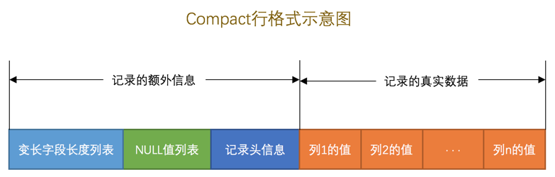

##### 记录的额外信息

- 变长字段长度列表

在 Compact 行格式中，把所有变长字段的真实数据占用的字节长度都存放在记录的开头部位，从而形成一个变长字段长度列表，各变长字段数据占用的字节数按照列的顺序逆序存放，我们再次强调一遍，是逆序存放！

变长字段长度列表中只存储值为 非NULL 的列内容占用的长度，值为 NULL 的列的长度是不储存的 。

- NULL值列表

1. 首先统计表中允许存储 NULL 的列有哪些。
2. 如果表中没有允许存储 NULL 的列，则 NULL值列表 也不存在了，否则将每个允许存储 NULL 的列对应一个

    二进制位，二进制位按照列的顺序逆序排列，二进制位表示的意义如下：

- 二进制位的值为 1 时，代表该列的值为 NULL 。
- 二进制位的值为 0 时，代表该列的值不为 NULL 。

- 记录头信息

它是由固定的 5 个字节组成。 5 个字节也就是 40 个二进制位，不同的位代表不同的意思，如图：

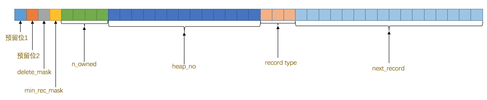

######  记录的真实数据

MySQL 会为每个记录默认的添加一些列（也称为 隐藏列 ），具体的列如下：

#### Redundant行格式

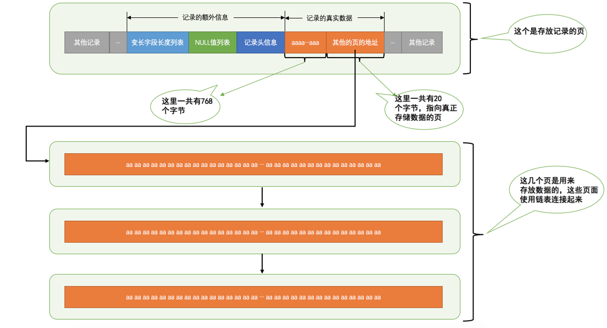

#### Dynamic和Compressed行格式

这两种行格式类似于 COMPACT行格式 ，只不过在处理行溢出数据时有点儿分歧，它们不会在记录的真实数据处存储字符串的前768个字节，而是把所有的字节都存储到其他页面中，只在记录的真实数据处存
储其他页面的地址。

另外， Compressed 行格式会采用压缩算法对页面进行压缩。

## InnoDB数据页结构

### 数据页结构

我们自己存储的记录会按照我们指定的 行格式 存储到 User Records 部分。但是在一开始生成页的时候，其实并没有 User Records 这个部分，每当我们插入一条记录，都会从 Free Space 部分，也就
是尚未使用的存储空间中申请一个记录大小的空间划分到 User Records 部分，当 Free Space 部分的空间全部被 User Records 部分替代掉之后，也就意味着这个页使用完了，如果还有新的记录插入的话，就需要去申请新的页了，这个过程的图示如下：

用户记录头信息

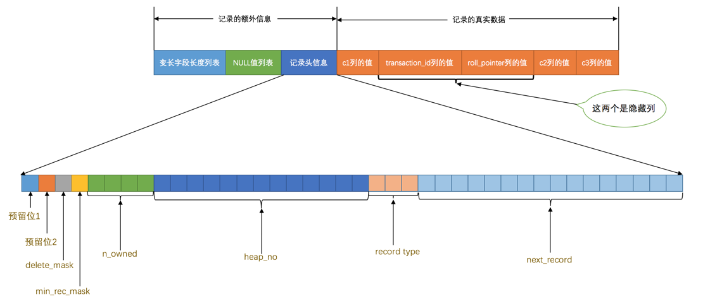

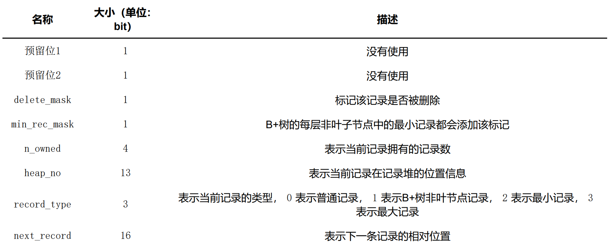

- record_type

这个属性表示当前记录的类型，一共有4种类型的记录， 0 表示普通记录， 1 表示B+树非叶节点记录， 2 表
示最小记录， 3 表示最大记录。

- next_record

它表示从当前记录的真实数据到下一条记录的真实数据的地址偏移量。

#### Page Directory（页目录）

记录在页中按照主键值由小到大顺序串联成一个单链表，如何在页中查找某条记录？设计 InnoDB 的大叔们为我们的记录也制作了一个类似的目录，他们的制作过程是这样的：

1. 将所有正常的记录（包括最大和最小记录，不包括标记为已删除的记录）划分为几个组。
2. 每个组的最后一条记录（也就是组内最大的那条记录）的头信息中的 n_owned 属性表示该记录拥有多少条记录，也就是该组内共有几条记录。
3. 将每个组的最后一条记录的地址偏移量单独提取出来按顺序存储到靠近 页 的尾部的地方，这个地方就是所
谓的 Page Directory ，也就是 页目录 （此时应该返回头看看页面各个部分的图）。页面目录中的这些地址
偏移量被称为 槽 （英文名： Slot ），所以这个页面目录就是由 槽 组成的。

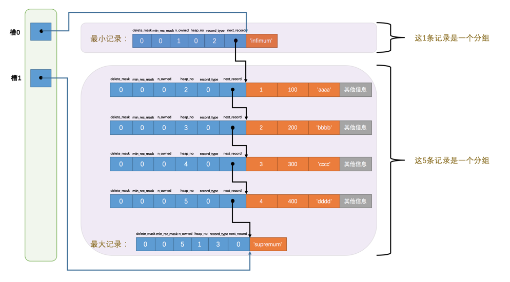

每个分组中的记录条数是有规定的：对于最小记录所在的分组只能有 1 条记录，最大记录所在的分组拥有的记录条数只能在 1~8 条之间，剩下的分组中记录的条数范围只能在是 4~8 条之间。

所以分组是按照下边的步骤进行的：

1. 初始情况下一个数据页里只有最小记录和最大记录两条记录，它们分属于两个分组。
2. 之后每插入一条记录，都会从 页目录 中找到主键值比本记录的主键值大并且差值最小的槽，然后把该槽对
应的记录的 n_owned 值加1，表示本组内又添加了一条记录，直到该组中的记录数等于8个。
3. 在一个组中的记录数等于8个后再插入一条记录时，会将组中的记录拆分成两个组，一个组中4条记录，另一
个5条记录。这个过程会在 页目录 中新增一个 槽 来记录这个新增分组中最大的那条记录的偏移量。

往表中添加了12条记录，现在页里边就一共有18条记录了（包括最小和最大记录），这些记录
被分成了5个组，如图所示：

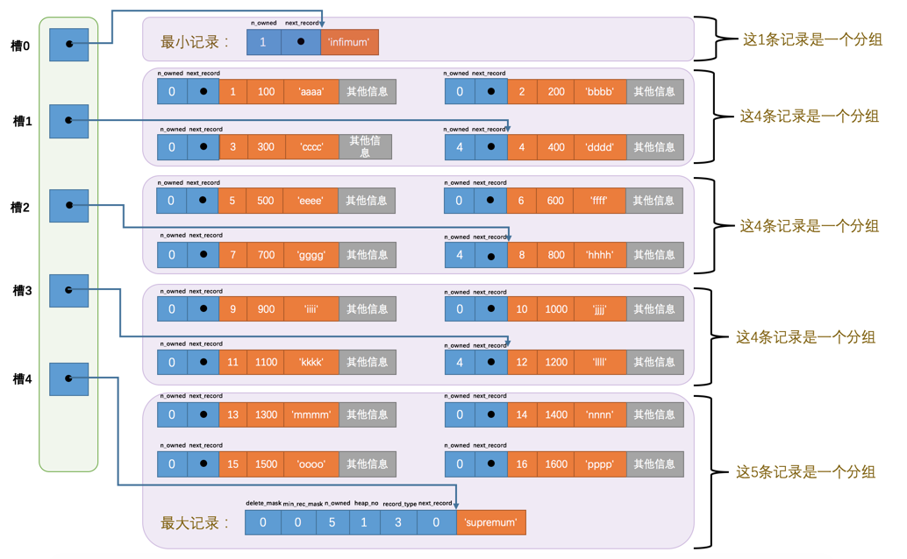

所以在一个数据页中查找指定主键值的记录的过程分为两步：
1. 通过二分法确定该记录所在的槽，并找到该槽中主键值最小的那条记录。
2. 通过记录的 next_record 属性遍历该槽所在的组中的各个记录。

#### Page Header（页面头部）

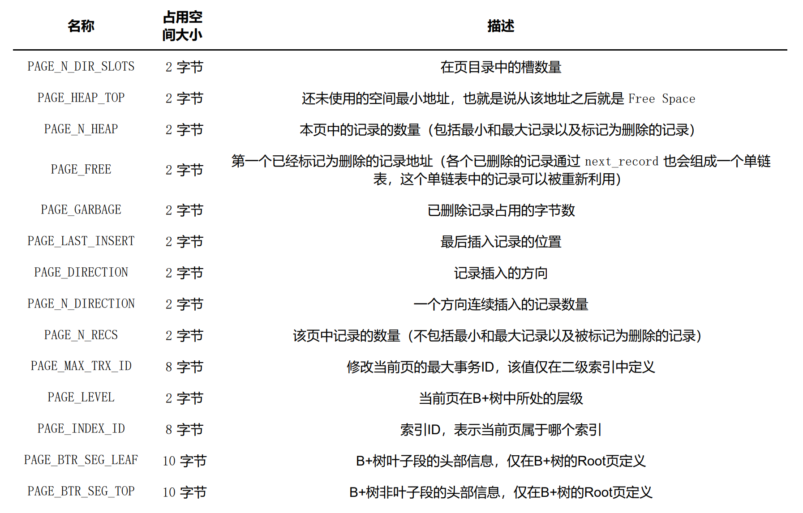

#### File Header（文件头部）

File Header 针对各种类型的页都通用，也就是说不同类型的页都会以 File Header 作为第一个组成部分，它描述了一些针对各种页都通用的一些信息，比方说这个页的编号是多少，它的上一个页、下一个页是谁。

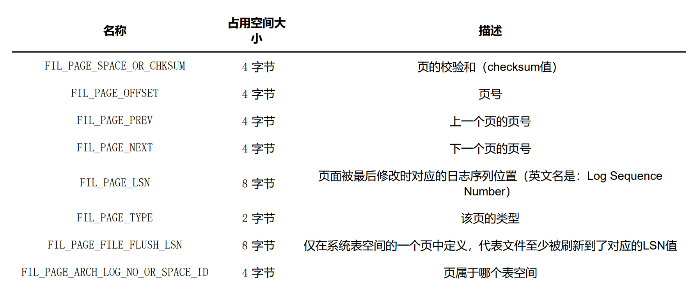

- FIL_PAGE_PREV 和 FIL_PAGE_NEXT

FIL_PAGE_PREV 和 FIL_PAGE_NEXT分别代表本页的上一个和下一个页的页号。这样通过建立一个双向链表把许许多多的页就都串联起来了，而无需这些页在物理上真正连着。

并不是所有类型的页都有上一个和下一个页的属性，不过
我们本集中唠叨的 数据页 （也就是类型为 FIL_PAGE_INDEX 的页）是有这两个属性的，所以所有的数据页其
实是一个双链表，就像这样：

#### File Trailer

为了检测一个页是否完整（也就是在同步的时候有没有发生只同步
一半的尴尬情况），设计 InnoDB 的大叔们在每个页的尾部都加了一个 File Trailer 部分，这个部分由 8 个字
节组成，可以分成2个小部分：

- 前4个字节代表页的校验和

这个部分是和 File Header 中的校验和相对应的。每当一个页面在内存中修改了，在同步之前就要把它的校验和算出来，因为 File Header 在页面的前边，所以校验和会被首先同步到磁盘，当完全写完时，校验和也会被写到页的尾部，如果完全同步成功，**则页的首部和尾部的校验和应该是一致的**。如果写了一半儿断电了，那么在 File Header 中的校验和就代表着已经修改过的页，而在 File Trialer 中的校验和代表着原先的页，二者不同则意味着同步中间出了错。

- 后4个字节代表页面被最后修改时对应的日志序列位置（LSN）这个部分也是为了校验页的完整性的。

#### 总结

## B+树索引

### 自治索引
每个页对应一个目录项，每个目录项包括下边两个部分：

- 页的用户记录中最小的主键值，我们用 key 来表示。
- 页号，我们用 page_no 表示。

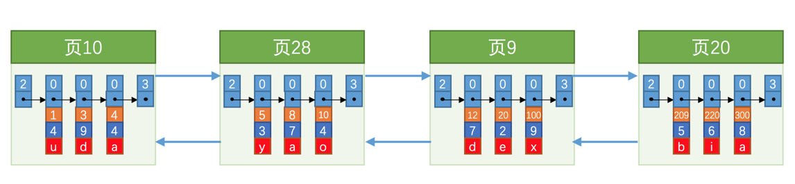

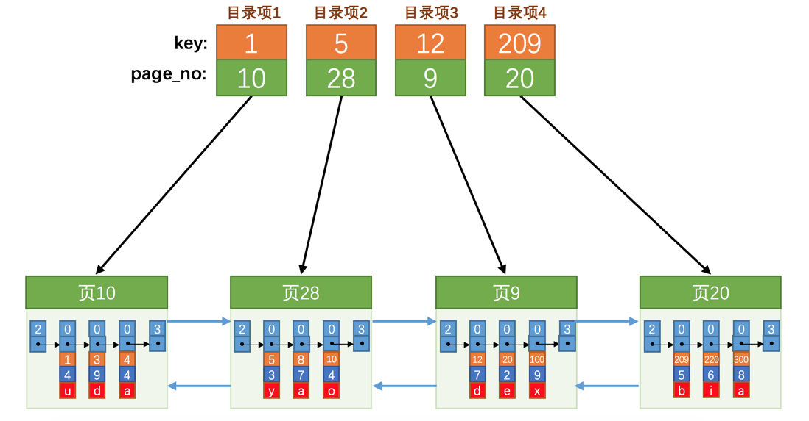

如果我们想找主键值为 20 的记录，具体查找过程分两步：
1. 先从目录项中根据二分法快速确定出主键值为 20 的记录在 目录项3 中（因为 12 < 20 < 209 ），它对应的页是 页9 。
2. 再根据前边说的在页中查找记录的方式去 页9 中定位具体的记录。

至此，针对数据页做的简易目录就搞定了。不过忘了说了，这个 目录 有一个别名，称为 索引 。

### InnoDB中的索引方案

目录项其实长得跟我们的用户记录差不多，只不过 目录项 中的两个列是 主键 和 页号 而已，所以他们复用了之前存储
用户记录的数据页来存储目录项，为了和用户记录做一下区分，我们把这些用来表示目录项的记录称为 目录项记
录 。使用记录头信息中的record_type属性来区分普通记录和目录项记录，record_type 属性，它的各个取值代表的意思如下：

- 0 ：普通的用户记录
- 1 ：目录项记录
- 2 ：最小记录
- 3 ：最大记录

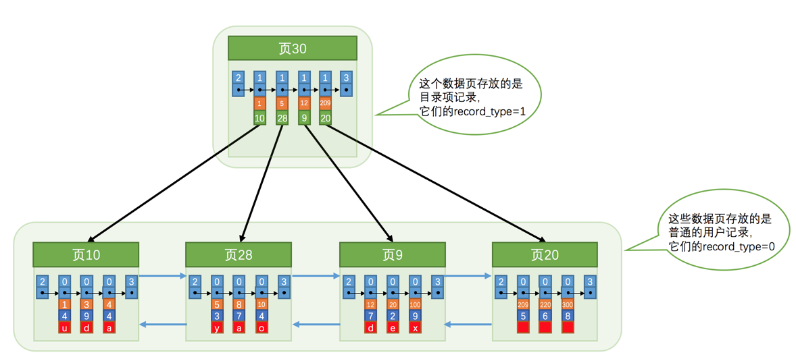

目录项记录特点：

1. 目录项记录 的 record_type 值是1，而普通用户记录的 record_type 值是0。
2. 目录项记录 只有主键值和页的编号两个列，而普通的用户记录的列是用户自己定义的，可能包含很多列，
另外还有 InnoDB 自己添加的隐藏列。
3. 还记得我们之前在唠叨记录头信息的时候说过一个叫 min_rec_mask 的属性么，只有在存储 目录项记录 的页中的主键值最小的 目录项记录 的 min_rec_mask 值为 1 ，其他别的记录的 min_rec_mask 值都是 0 。

现在以查找主键为 20 的记录为例，根据某个主键值去查找记录的步骤就可以大致拆分成下边两步：
1. 先到存储目录项记录的页，也就是页 30 中通过二分法快速定位到对应目录项，因为 12 < 20 < 209 ，所
以定位到对应的记录所在的页就是 页9 。
2. 再到存储用户记录的 页9 中根据二分法快速定位到主键值为 20 的用户记录。

如何存储多个目录项记录页？

如果我们表中的数据非常多则会产生很多存储 目录项记录 的页，那我们怎么根据主键值快速定位一个
存储 目录项记录 的页呢？其实也简单，为这些存储 目录项记录 的页再生成一个更高级的目录，就像是一个多级
目录一样，大目录里嵌套小目录，小目录里才是实际的数据，所以现在各个页的示意图就是这样子：

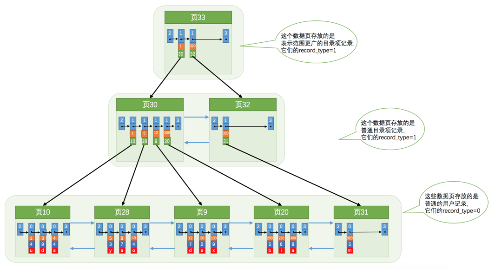

## 事务基础语法

### 开启事务

- BEGIN [WORK]

- START TRANSACTION

可以在 START TRANSACTION 语句后边跟随几个 修饰符：

1. READ ONLY ：标识当前事务是一个只读事务，也就是属于该事务的数据库操作只能读取数据，而不能修
改数据。

2. READ WRITE ：标识当前事务是一个读写事务，也就是属于该事务的数据库操作既可以读取数据，也可
以修改数据。
3. WITH CONSISTENT SNAPSHOT ：启动一致性读

如果我们想在 START TRANSACTION 后边跟随多个 修饰符 的话，可以使用逗号将 修饰符 分开，比如开启一个只读事务和一致性读，就可以这样写：
START TRANSACTION READ ONLY, WITH CONSISTENT SNAPSHOT;

**如果我们不显式指定事务的访问模式，那么该事务的访问模式就是 读写 模式**

### 提交事务

COMMIT [WORK]

### 手动终止事务

如果我们写了几条语句之后发现上边的某条语句写错了，我们可以手动的使用下边这个语句来将数据库恢复到事务执行之前的样子：

ROLLBACK [WORK]

这里需要强调一下， ROLLBACK 语句是我们程序员手动的去回滚事务时才去使用的，如果事务在执行过程中遇到了某些错误而无法继续执行的话，事务自身会自动的回滚。

MySQL 中并不是所有存储引擎都支持事务的功能，目前只有 InnoDB 和 NDB 存储引擎支持（NDB存储引擎不是我们的重点），如果某个事务中包含了修改使用不支持事务的存储引擎的表，那么对该使用不支持事务的存储引擎的表所做的修改将无法进行回滚。

### 自动提交
mysql默认是自动提交模式，如果我们不显式的使用 START TRANSACTION 或者 BEGIN 语句开启一个事务，那么每一条语句都算是一个独立的事务，这种特性称之为事务的 自动提交 。

mysql> SHOW VARIABLES LIKE 'autocommit';
+---------------+-------+
| Variable_name | Value |
+---------------+-------+
| autocommit    | ON    |
+---------------+-------+
1 row in set (0.01 sec)

关闭自动提交：
1. 显式的的使用 START TRANSACTION 或者 BEGIN 语句开启一个事务。这样在本次事务提交或者回滚前会暂时关闭掉自动提交的功能。
2. 把系统变量 autocommit 的值设置为 OFF ，就像这样：SET autocommit = OFF;

### 隐式提交

1. 定义或修改数据库对象的数据定义语言（Data definition language，缩写为： DDL ）。所谓的数据库对象，指的就是 数据库 、 表 、 视图 、 存储过程 等等这些东西。当我们使用 CREATE 、
ALTER 、 DROP 等语句去修改这些所谓的数据库对象时，就会隐式的提交前边语句所属于的事务，就像这
样：

 BEGIN; 
 SELECT ... # 事务中的一条语句 
 UPDATE ... # 事务中的一条语句 
 ... # 事务中的其它语句 
 CREATE TABLE ... # 此语句会隐式的提交前边语句所属于的事务

2. 隐式使用或修改 mysql 数据库中的表。当我们使用 ALTER USER 、 CREATE USER 、 DROP USER 、 GRANT 、 RENAME USER 、 REVOKE 、 SET PASSWORD 等语句时也会隐式的提交前边语句所的事务。

3. 事务控制或关于锁定的语句
当我们在一个事务还没提交或者回滚时就又使用 START TRANSACTION 或者 BEGIN 语句开启了另一个事务时，会隐式的提交上一个事务，比如这样：

BEGIN; 
 SELECT ... # 事务中的一条语句 
 UPDATE ... # 事务中的一条语句 
 ... # 事务中的其它语句 
BEGIN; # 此语句会隐式的提交前边语句所属于的事务

或者当前的 autocommit 系统变量的值为 OFF ，我们手动把它调为 ON 时，也会隐式的提交前边语句所属的事务。

或者使用 LOCK TABLES 、 UNLOCK TABLES 等关于锁定的语句也会隐式的提交前边语句所属的事务。

4. 加载数据的语句
比如我们使用 LOAD DATA 语句来批量往数据库中导入数据时，也会隐式的提交前边语句所属的事务。

5. 关于mysql复制的一些语句

使用 START SLAVE 、 STOP SLAVE 、 RESET SLAVE 、 CHANGE MASTER TO 等语句时也会隐式的提交前边语句所属的事务。

6. 其他一些语句

使用 ANALYZE TABLE 、 CACHE INDEX 、 CHECK TABLE 、 FLUSH 、 LOAD INDEX INTO CACHE 、 OPTIMIZE TABLE 、 REPAIR TABLE 、 RESET 等语句也会隐式的提交前边语句所属的事务。

### 保存点

在事务对应的数据库语句中打几个点，我们在调用 ROLLBACK 语句时可以指定会滚到哪个点，而不是回到最初的原点。定义保存点的语法如下：

SAVEPOINT 保存点名称;

当我们想回滚到某个保存点时，可以使用下边这个语句（下边语句中的单词 WORK 和 SAVEPOINT 是可有可无的）：

ROLLBACK [WORK] TO [SAVEPOINT] 保存点名称;

不过如果 ROLLBACK 语句后边不跟随保存点名称的话，会直接回滚到事务执行之前的状态。

如果我们想删除某个保存点，可以使用这个语句：

RELEASE SAVEPOINT 保存点名称;

示例：

mysql> SELECT * FROM account; 
+----+--------+---------+ 
| id | name | balance | 
+----+--------+---------+ 
| 1 | 狗哥 | 11 | 
| 2 | 猫爷 | 2 | 
+----+--------+---------+ 
2 rows in set (0.00 sec) 

mysql> BEGIN; 
Query OK, 0 rows affected (0.00 sec) 

mysql> UPDATE account SET balance = balance - 10 WHERE id = 1; 
Query OK, 1 row affected (0.01 sec) 
Rows matched: 1 Changed: 1 Warnings: 0 

mysql> SAVEPOINT s1; # 一个保存点 
Query OK, 0 rows affected (0.00 sec) 

mysql> SELECT * FROM account; 
+----+--------+---------+ 
| id | name | balance | 
+----+--------+---------+ 
| 1 | 狗哥 | 1 | 
| 2 | 猫爷 | 2 | 
+----+--------+---------+ 
2 rows in set (0.00 sec) 

mysql> UPDATE account SET balance = balance + 1 WHERE id = 2; # 更新错了 
Query OK, 1 row affected (0.00 sec) 
Rows matched: 1 Changed: 1 Warnings: 0 

mysql> ROLLBACK TO s1; # 回滚到保存点s1处 
Query OK, 0 rows affected (0.00 sec) 
mysql> SELECT * FROM account; 
+----+--------+---------+ 
| id | name | balance | 
+----+--------+---------+ 
| 1 | 狗哥 | 1 | 
| 2 | 猫爷 | 2 | 
+----+--------+---------+ 
2 rows in set (0.00 sec)

