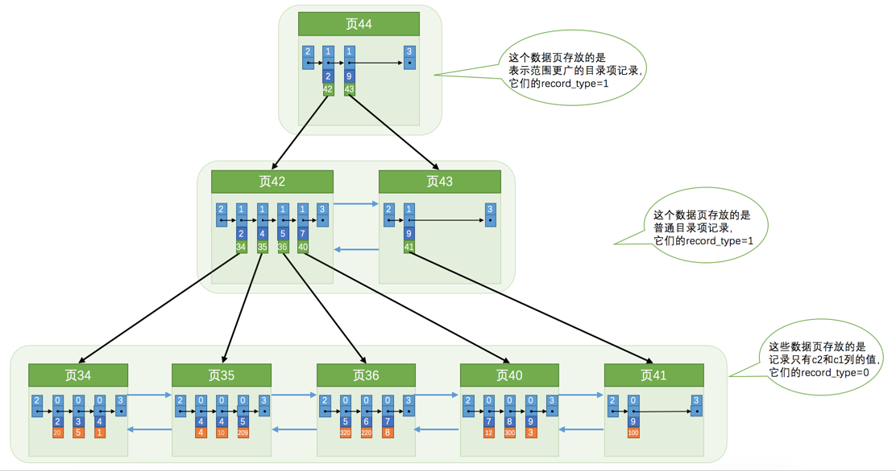
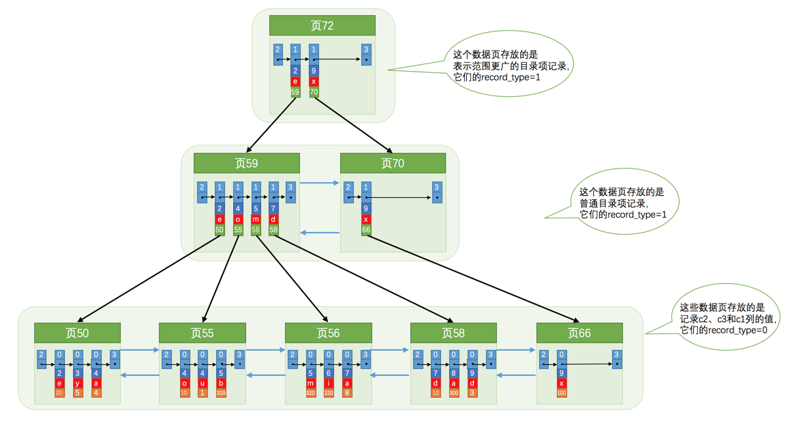
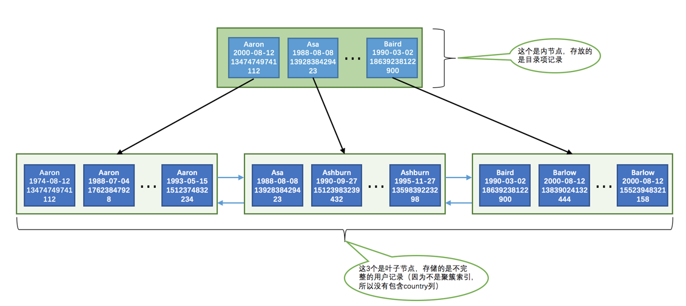

## InnoDB记录结构

MySQL 服务器上负责对表中数据的读取和写入工作的部分是 存储引擎 ，而服务器又支持不同类型的存储引擎，真实数据在不同存储引擎中存放的格式一般是不同的。

InnoDB存储引擎最终会把数据存储在磁盘中，数据处理的过程是将数据从磁盘加载到内存，在内存中对数据进行操作后，再将数据写入磁盘。InnDB采用分页的形式对数据进行读写，将数据划分为若干个页，以页作为磁盘和内存之间交互的基本单位，InnoDB中页的大小一般为 16 KB。

### InnoDB的行格式

我们平时是以记录为单位来向表中插入数据的，这些记录在磁盘上的存放方式也被称为 行格式 或者 记录格式 。主要有四种行格式：

- Compact
- Redundant
- Dynamic
- Compressed

创建表时指定行格式：

CREATE TABLE 表名 (列的信息) ROW_FORMAT=行格式名称 

ALTER TABLE 表名 ROW_FORMAT=行格式名称

示例：

mysql> CREATE TABLE record_format_demo ( 
 -> c1 VARCHAR(10), 
 -> c2 VARCHAR(10) NOT NULL, 
 -> c3 CHAR(10), 
 -> c4 VARCHAR(10) 
 -> ) CHARSET=ascii ROW_FORMAT=COMPACT; 


#### Compact格式


##### 记录的额外信息

- 变长字段长度列表

在 Compact 行格式中，把所有变长字段的真实数据占用的字节长度都存放在记录的开头部位，从而形成一个变长字段长度列表，各变长字段数据占用的字节数按照列的顺序逆序存放，我们再次强调一遍，是逆序存放！

变长字段长度列表中只存储值为 非NULL 的列内容占用的长度，值为 NULL 的列的长度是不储存的 。

- NULL值列表

1. 首先统计表中允许存储 NULL 的列有哪些。
2. 如果表中没有允许存储 NULL 的列，则 NULL值列表 也不存在了，否则将每个允许存储 NULL 的列对应一个

    二进制位，二进制位按照列的顺序逆序排列，二进制位表示的意义如下：

- 二进制位的值为 1 时，代表该列的值为 NULL 。
- 二进制位的值为 0 时，代表该列的值不为 NULL 。


- 记录头信息

它是由固定的 5 个字节组成。 5 个字节也就是 40 个二进制位，不同的位代表不同的意思，如图：


######  记录的真实数据

MySQL 会为每个记录默认的添加一些列（也称为 隐藏列 ），具体的列如下：


#### Redundant行格式


#### Dynamic和Compressed行格式

这两种行格式类似于 COMPACT行格式 ，只不过在处理行溢出数据时有点儿分歧，它们不会在记录的真实数据处存储字符串的前768个字节，而是把所有的字节都存储到其他页面中，只在记录的真实数据处存
储其他页面的地址。

另外， Compressed 行格式会采用压缩算法对页面进行压缩。


## InnoDB数据页结构


### 数据页结构


我们自己存储的记录会按照我们指定的 行格式 存储到 User Records 部分。但是在一开始生成页的时候，其实并没有 User Records 这个部分，每当我们插入一条记录，都会从 Free Space 部分，也就
是尚未使用的存储空间中申请一个记录大小的空间划分到 User Records 部分，当 Free Space 部分的空间全部被 User Records 部分替代掉之后，也就意味着这个页使用完了，如果还有新的记录插入的话，就需要去申请新的页了，这个过程的图示如下：


用户记录头信息


- record_type

这个属性表示当前记录的类型，一共有4种类型的记录， 0 表示普通记录， 1 表示B+树非叶节点记录， 2 表
示最小记录， 3 表示最大记录。

- next_record

它表示从当前记录的真实数据到下一条记录的真实数据的地址偏移量。

#### Page Directory（页目录）

记录在页中按照主键值由小到大顺序串联成一个单链表，如何在页中查找某条记录？设计 InnoDB 的大叔们为我们的记录也制作了一个类似的目录，他们的制作过程是这样的：

1. 将所有正常的记录（包括最大和最小记录，不包括标记为已删除的记录）划分为几个组。
2. 每个组的最后一条记录（也就是组内最大的那条记录）的头信息中的 n_owned 属性表示该记录拥有多少条记录，也就是该组内共有几条记录。
3. 将每个组的最后一条记录的地址偏移量单独提取出来按顺序存储到靠近 页 的尾部的地方，这个地方就是所
谓的 Page Directory ，也就是 页目录 （此时应该返回头看看页面各个部分的图）。页面目录中的这些地址
偏移量被称为 槽 （英文名： Slot ），所以这个页面目录就是由 槽 组成的。


每个分组中的记录条数是有规定的：对于最小记录所在的分组只能有 1 条记录，最大记录所在的分组拥有的记录条数只能在 1~8 条之间，剩下的分组中记录的条数范围只能在是 4~8 条之间。


所以分组是按照下边的步骤进行的：

1. 初始情况下一个数据页里只有最小记录和最大记录两条记录，它们分属于两个分组。
2. 之后每插入一条记录，都会从 页目录 中找到主键值比本记录的主键值大并且差值最小的槽，然后把该槽对
应的记录的 n_owned 值加1，表示本组内又添加了一条记录，直到该组中的记录数等于8个。
3. 在一个组中的记录数等于8个后再插入一条记录时，会将组中的记录拆分成两个组，一个组中4条记录，另一
个5条记录。这个过程会在 页目录 中新增一个 槽 来记录这个新增分组中最大的那条记录的偏移量。

往表中添加了12条记录，现在页里边就一共有18条记录了（包括最小和最大记录），这些记录
被分成了5个组，如图所示：


所以在一个数据页中查找指定主键值的记录的过程分为两步：
1. 通过二分法确定该记录所在的槽，并找到该槽中主键值最小的那条记录。
2. 通过记录的 next_record 属性遍历该槽所在的组中的各个记录。

#### Page Header（页面头部）


#### File Header（文件头部）

File Header 针对各种类型的页都通用，也就是说不同类型的页都会以 File Header 作为第一个组成部分，它描述了一些针对各种页都通用的一些信息，比方说这个页的编号是多少，它的上一个页、下一个页是谁。


- FIL_PAGE_PREV 和 FIL_PAGE_NEXT

FIL_PAGE_PREV 和 FIL_PAGE_NEXT分别代表本页的上一个和下一个页的页号。这样通过建立一个双向链表把许许多多的页就都串联起来了，而无需这些页在物理上真正连着。

并不是所有类型的页都有上一个和下一个页的属性，不过
我们本集中唠叨的 数据页 （也就是类型为 FIL_PAGE_INDEX 的页）是有这两个属性的，所以所有的数据页其
实是一个双链表，就像这样：


#### File Trailer

为了检测一个页是否完整（也就是在同步的时候有没有发生只同步
一半的尴尬情况），设计 InnoDB 的大叔们在每个页的尾部都加了一个 File Trailer 部分，这个部分由 8 个字
节组成，可以分成2个小部分：

- 前4个字节代表页的校验和

这个部分是和 File Header 中的校验和相对应的。每当一个页面在内存中修改了，在同步之前就要把它的校验和算出来，因为 File Header 在页面的前边，所以校验和会被首先同步到磁盘，当完全写完时，校验和也会被写到页的尾部，如果完全同步成功，**则页的首部和尾部的校验和应该是一致的**。如果写了一半儿断电了，那么在 File Header 中的校验和就代表着已经修改过的页，而在 File Trialer 中的校验和代表着原先的页，二者不同则意味着同步中间出了错。

- 后4个字节代表页面被最后修改时对应的日志序列位置（LSN）这个部分也是为了校验页的完整性的。

#### 总结


## B+树索引

### 自治索引
每个页对应一个目录项，每个目录项包括下边两个部分：

- 页的用户记录中最小的主键值，我们用 key 来表示。
- 页号，我们用 page_no 表示。


如果我们想找主键值为 20 的记录，具体查找过程分两步：
1. 先从目录项中根据二分法快速确定出主键值为 20 的记录在 目录项3 中（因为 12 < 20 < 209 ），它对应的页是 页9 。
2. 再根据前边说的在页中查找记录的方式去 页9 中定位具体的记录。

至此，针对数据页做的简易目录就搞定了。不过忘了说了，这个 目录 有一个别名，称为 索引 。

### InnoDB中的索引方案

目录项其实长得跟我们的用户记录差不多，只不过 目录项 中的两个列是 主键 和 页号 而已，所以他们复用了之前存储
用户记录的数据页来存储目录项，为了和用户记录做一下区分，我们把这些用来表示目录项的记录称为 目录项记
录 。使用记录头信息中的record_type属性来区分普通记录和目录项记录，record_type 属性，它的各个取值代表的意思如下：

- 0 ：普通的用户记录
- 1 ：目录项记录
- 2 ：最小记录
- 3 ：最大记录


目录项记录特点：

1. 目录项记录 的 record_type 值是1，而普通用户记录的 record_type 值是0。
2. 目录项记录 只有主键值和页的编号两个列，而普通的用户记录的列是用户自己定义的，可能包含很多列，
另外还有 InnoDB 自己添加的隐藏列。
3. 还记得我们之前在唠叨记录头信息的时候说过一个叫 min_rec_mask 的属性么，只有在存储 目录项记录 的页中的主键值最小的 目录项记录 的 min_rec_mask 值为 1 ，其他别的记录的 min_rec_mask 值都是 0 。


现在以查找主键为 20 的记录为例，根据某个主键值去查找记录的步骤就可以大致拆分成下边两步：
1. 先到存储目录项记录的页，也就是页 30 中通过二分法快速定位到对应目录项，因为 12 < 20 < 209 ，所
以定位到对应的记录所在的页就是 页9 。
2. 再到存储用户记录的 页9 中根据二分法快速定位到主键值为 20 的用户记录。

如何存储多个目录项记录页？

如果我们表中的数据非常多则会产生很多存储 目录项记录 的页，那我们怎么根据主键值快速定位一个
存储 目录项记录 的页呢？其实也简单，为这些存储 目录项记录 的页再生成一个更高级的目录，就像是一个多级
目录一样，大目录里嵌套小目录，小目录里才是实际的数据，所以现在各个页的示意图就是这样子：


从图中可以看出来，我们的实际用户记录其实都存放在B+树的最底层的节点上，这些节点也被称为 叶子节点 或 叶节点 ，其余用来存放 目录项 的节点称为 非叶子节点 或者 内节点 ，其中B+ 树最上边的那个节点也称为 根节点 。最下边的
那层，也就是存放我们用户记录的那层为第 0 层，之后依次往上加。

一般情况下，我们用到的 B+ 树都不会超过4层，那我们通过主键值去查找某条记录最多只需要做4个页面内的查找（查找3个目录项页和一个用户记录页）。

#### 聚簇索引

特点：

1. 使用记录主键值的大小进行记录和页的排序，这包括三个方面的含义：

- 页内的记录是按照主键的大小顺序排成一个单向链表。
- 各个存放用户记录的页也是根据页中用户记录的主键大小顺序排成一个双向链表。
- 存放目录项记录的页分为不同的层次，在同一层次中的页也是根据页中目录项记录的主键大小顺序排成一个双向链表。

2. B+ 树的叶子节点存储的是完整的用户记录。

所谓完整的用户记录，就是指这个记录中存储了所有列的值（包括隐藏列）。

我们把具有这两种特性的 B+ 树称为 聚簇索引 ，所有完整的用户记录都存放在这个 聚簇索引 的叶子节点处。InnoDB 存储引擎会自动的为我们创建聚簇索引。

#### 二级索引

聚簇索引 只能在搜索条件是主键值时才能发挥作用，因为 B+ 树中的数据都是按照主键进行排序的。那如果我们想以别的列作为搜索条件该咋办呢？

我们可以多建几棵 B+ 树，不同的 B+ 树中的数据采用不同的排序规则。比方说我们用 c2 列的大小作为数据页、页中记录的排序规则，再建一棵 B+ 树，效果如下图所示：



这个 B+ 树与上边介绍的聚簇索引有几处不同：
- 使用记录 c2 列的大小进行记录和页的排序，这包括三个方面的含义：
- 页内的记录是按照 c2 列的大小顺序排成一个单向链表。
- 各个存放用户记录的页也是根据页中记录的 c2 列大小顺序排成一个双向链表。
- 存放目录项记录的页分为不同的层次，在同一层次中的页也是根据页中目录项记录的 c2 列大小顺序排成一个双向链表。
- B+ 树的叶子节点存储的并不是完整的用户记录，**而只是 c2列+主键 这两个列的值。目录项记录中不再是 主键+页号 的搭配，而变成了 c2列+页号 的搭配**。

我们根据这个以 c2 列大小排序的 B+ 树只能确定我们要查找记录的主键值，所以如果我们想根据 c2 列的值查找到完整的用户记录的话，仍然需要到 聚簇索引 中再查一遍，这个过程也被称为 回表 。也就是根据 c2 列的值查询一条完整的用户记录需要使用到 2 棵 B+ 树！！！

因为这种按照 非主键列 建立的 B+ 树需要一次 回表 操作才可以定位到完整的用户记录，所以这种 B+ 树也被称为 二级索引 （英文名 secondary index ），或者 辅助索引 。由于我们使用的是 c2 列的大小作为 B+ 树的排序规则，所以我们也称这个 B+ 树为为c2列建立的索引。

#### 联合索引

我们也可以同时以多个列的大小作为排序规则，也就是同时为多个列建立索引，比方说我们想让 B+ 树按照 c2和 c3 列的大小进行排序，这个包含两层含义：

1. 先把各个记录和页按照 c2 列进行排序。
2. 在记录的 c2 列相同的情况下，采用 c3 列进行排序

为 c2 和 c3 列建立的索引的示意图如下：


需要注意：
- 每条 目录项记录 都由 c2 、 c3 、 页号 这三个部分组成，各条记录先按照 c2 列的值进行排序，如果记录的 c2 列相同，则按照 c3 列的值进行排序。
- B+ 树叶子节点处的用户记录由 c2 、 c3 和主键 c1 列组成。

### InnoDB的B+树索引的注意事项

一个B+树索引的根节点自诞生之日起，便不会再移动。这样只要我们对某个表建立一个索引，那么它的 根节点 的页号便会被记录到某个地方，然后凡是 InnoDB 存储引擎需要用到这个索引的时候，都会从那个固定的地方取出 根节点 的页号，从而来访问这个索引。


为了让新插入记录能找到自己在那个页里，我们需要保证在B+树的同一层内节点的目录项记录除 页号 这个字段以外是唯一的。所以对于二级索引的内节点的目录项记录的内容实际上是由三个部分构成的：

1. 索引列的值
2. 主键值
3. 页号

一个页面最少存储2条记录。

### MySQL中创建和删除索引的语句

InnoDB 和 MyISAM 会自动为主键或者声明为 UNIQUE 的列去自动建立 B+ 树索引。

我们可以在创建表的时候指定需要建立索引的单个列或者建立联合索引的多个列：

CREATE TALBE 表名 ( 
 各种列的信息 ··· , 
 [KEY|INDEX] 索引名 (需要被索引的单个列或多个列) 
)

比方说我们想在创建 index_demo 表的时候就为 c2 和 c3 列添加一个 联合索引 ，可以这么写建表语句：
CREATE TABLE index_demo( 
 c1 INT, 
 c2 INT, 
 c3 CHAR(1), 
 PRIMARY KEY(c1), 
 INDEX idx_c2_c3 (c2, c3) 
);

如果我们想删除这个索引，可以这么写：

ALTER TABLE index_demo DROP INDEX idx_c2_c3;

## B+树索引的使用

### B+树索引适用的条件

创建一个表：

CREATE TABLE person_info( 
 id INT NOT NULL auto_increment, 
 name VARCHAR(100) NOT NULL, 
 birthday DATE NOT NULL, 
 phone_number CHAR(11) NOT NULL, 
 country varchar(100) NOT NULL, 
 PRIMARY KEY (id), 
 KEY idx_name_birthday_phone_number (name, birthday, phone_number) 
);


对于这个 person_info 表我们需要注意两点：
- 表中的主键是 id 列，它存储一个自动递增的整数。所以 InnoDB 存储引擎会自动为 id 列建立聚簇索引。
- 我们额外定义了一个二级索引 idx_name_birthday_phone_number ，它是由3个列组成的联合索引。所以在这个索引对应的 B+ 树的叶子节点处存储的用户记录只保留 name 、 birthday 、 phone_number 这三个列的值以及主键 id 的值，并不会保存 country 列的值。



这个 idx_name_birthday_phone_number 索引对应的 B+ 树中页面和记录的排序方式就是这样的：

- 先按照 name 列的值进行排序。
- 如果 name 列的值相同，则按照 birthday 列的值进行排序。
- 如果 birthday 列的值也相同，则按照 phone_number 的值进行排序。

#### 全值匹配

如果我们的搜索条件中的列和索引列一致的话，这种情况就称为全值匹配，比方说下边这个查找语句：
SELECT * FROM person_info WHERE name = 'Ashburn' AND birthday = '1990-09-27' AND phone_number ='15123983239';

WHERE 子句中的几个搜索条件的顺序对查询结果没有影响，MySQL的查询优化器会对查询语句进行优化。

#### 匹配左边的列

其实在我们的搜索语句中也可以不用包含全部联合索引中的列，只包含左边的就行，比方说下边的查询语句：
SELECT * FROM person_info WHERE name = 'Ashburn';

或者包含多个左边的列也行：
SELECT * FROM person_info WHERE name = 'Ashburn' AND birthday = '1990-09-27';

**如果我们想使用联合索引中尽可能多的列，搜索条件中的各个列必须是联合索引中从最左边连续的列**。比方说联合索引 idx_name_birthday_phone_number 中列的定义顺序是 name 、birthday 、 phone_number ，如果我们的搜索条件中只有 name 和 phone_number ，而没有中间的 birthday ，
比方说这样：

SELECT * FROM person_info WHERE name = 'Ashburn' AND phone_number = '15123983239';

这样只能用到 name 列的索引， birthday 和 phone_number 的索引就用不上了，因为 name 值相同的记录先按照
birthday 的值进行排序， birthday 值相同的记录才按照 phone_number 值进行排序。

#### 匹配列前缀

字符串的前n个字符，也就是前缀都是排好序的，所以对于字符串类型的索引列来说，我们只匹配它的前缀也是可以快速定位记录的，比方说我们想查询名字以 'As' 开头的记录，那就可以这么写查询语句：
```
SELECT * FROM person_info WHERE name LIKE 'As%';
```

但是需要注意的是，如果只给出后缀或者中间的某个字符串，比如这样：

```
SELECT * FROM person_info WHERE name LIKE '%As%';
```

MySQL 就无法快速定位记录位置了，因为字符串中间有 'As' 的字符串并没有排好序，所以只能全表扫描了。

#### 匹配范围值

使用联合进行范围查找的时候需要注意，如果对多个列同时进行范围查找的话，只有对索引最左边的那个列进行范围查找的时候才能用到 B+ 树索引，比方说这样：

```
SELECT * FROM person_info WHERE name > 'Asa' AND name < 'Barlow' AND birthday > '1980-01-01';

```

这样子对于联合索引 idx_name_birthday_phone_number 来说，只能用到 name 列的部分，而用不到 birthday 列
的部分，因为只有 name 值相同的情况下才能用 birthday 列的值进行排序，而这个查询中通过 name 进行范围查
找的记录中可能并不是按照 birthday 列进行排序的，所以在搜索条件中继续以 birthday 列进行查找时是用不到
这个 B+ 树索引的。

#### 精确匹配某一列并范围匹配另外一列

对于同一个联合索引来说，虽然对多个列都进行范围查找时只能用到最左边那个索引列，但是如果左边的列是精确查找，则右边的列可以进行范围查找，比方说这样：

```
SELECT * FROM person_info WHERE name = 'Ashburn' AND birthday > '1980-01-01' AND birthday< '2000-12-31' AND phone_number > '15100000000';

```

#### 用于排序

在 MySQL 中，把这种在内存中或者磁盘上进行排序的方式统称为文件排序（英文名： filesort ），跟 文件 这个词儿一沾边儿，就显得这些排序操作非常慢了（磁盘和内存的速度比起来，就像是飞机和蜗牛的对比）。但是如果 ORDER BY 子句里使用到了我们的
索引列，就有可能省去在内存或文件中排序的步骤，比如下边这个简单的查询语句：

```
SELECT * FROM person_info ORDER BY name, birthday, phone_number LIMIT 10;
```

这个查询的结果集需要先按照 name 值排序，如果记录的 name 值相同，则需要按照 birthday 来排序，如果birthday 的值相同，则需要按照 phone_number 排序。因为这个 B+ 树索引本身就是按照上述规则排好序的，所以直接从索引中提取数据，然后进行 回表 操作取出该索引中不包含的列就好了。


对于 联合索引 有个问题需要注意， ORDER BY 的子句后边的列的顺序也必须按照索引列的顺序给出，如果给出
ORDER BY phone_number, birthday, name 的顺序，那也是用不了 B+ 树索引。

同理， ORDER BY name 、 ORDER BY name, birthday **这种匹配索引左边的列的形式可以使用部分的 B+ 树索引**。
当联合索引左边列的值为常量，也可以使用后边的列进行排序，比如这样：

```
SELECT * FROM person_info WHERE name = 'A' ORDER BY birthday, phone_number LIMIT 10;

```

##### 不可以使用索引进行排序的几种情况

- ASC、DESC混用

对于使用联合索引进行排序的场景，我们要求各个排序列的排序顺序是一致的，也就是要么各个列都是 ASC 规则排序，要么都是 DESC 规则排序。


- WHERE子句中出现非排序使用到的索引列
如果WHERE子句中出现了非排序使用到的索引列，那么排序依然是使用不到索引的，比方说这样：

```
SELECT * FROM person_info WHERE country = 'China' ORDER BY name LIMIT 10;
```

- 排序列包含非同一个索引的列

有时候用来排序的多个列不是一个索引里的，这种情况也不能使用索引进行排序，比方说：

```
SELECT * FROM person_info ORDER BY name, country LIMIT 10;
```

name 和 country 并不属于一个联合索引中的列，所以无法使用索引进行排序.

- 排序列使用了复杂的表达式


要想使用索引进行排序操作，必须保证索引列是以单独列的形式出现，而不是修饰过的形式，比方说这样：

```
SELECT * FROM person_info ORDER BY UPPER(name) LIMIT 10;
```

使用了 UPPER 函数修饰过的列就不是单独的列啦，这样就无法使用索引进行排序啦。

#### 用于分组

有时候我们为了方便统计表中的一些信息，会把表中的记录按照某些列进行分组。比如下边这个分组查询：

```
SELECT name, birthday, phone_number, COUNT(*) FROM person_info GROUP BY name, birthday, phone_number
```

### 如何挑选索引

- 只为出现在 WHERE 子句中的列、连接子句中的连接列，或者出现在 ORDER BY 或 GROUP BY 子句中的列创建索引。而出现在查询列表中的列就没必要建立索引了：

```
SELECT birthday, country FROM person name WHERE name = 'Ashburn';
```

像查询列表中的 birthday 、 country 这两个列就不需要建立索引，我们只需要为出现在 WHERE 子句中的 name列创建索引就可以了。

- 列的基数 指的是某一列中不重复数据的个数, 最好为那些列的基数大的列建立索引，为基数太小列的建立索引效果可能不好。

- 索引列的类型尽量小

-  只对字符串的前几个字符进行索引也就是说在二级索引的记录中只保留字符串前几个字符

- 如果索引列在比较表达式中不是以单独列的形式出现，而是以某个表达式，或者函数调用形式出现的话，是用不到索引的。

- 让主键具有 AUTO_INCREMENT ，让存储引擎自己为表生成主键，而不是我们手动插入

## Mysql 数据目录

InnoDB 、 MyISAM 这样的存储引擎都是把表存储在文件系统上。

MySQL 把数据都存到哪个路径下呢？其实 数据目录 对应着一个系统变量 datadir ，我们在使用客户端与服务器建立连接之后查看这个系统变量的值就可以了：

mysql> SHOW VARIABLES LIKE 'datadir';
+---------------+-----------------+
| Variable_name | Value           |
+---------------+-----------------+
| datadir       | /var/lib/mysql/ |
+---------------+-----------------+
1 row in set (0.01 sec)


### 数据目录结构

每当我们新建一个数据库时， MySQL 会帮我们做这两件事儿：
1. 在数据目录下创建一个和数据库名同名的子目录（或者说是文件夹）。
2. 在该与数据库名同名的子目录下创建一个名为 db.opt 的文件，这个文件中包含了该数据库的各种属性，比方说该数据库的字符集和比较规则是个啥。


#### 表在文件系统中的表示

我们的数据其实都是以记录的形式插入到表中的，每个表的信息其实可以分为两种：
1. 表结构的定义
2. 表中的数据

表结构 就是该表的名称是啥，表里边有多少列，每个列的数据类型是啥，有啥约束条件和索引，用的是啥字符
集等各种信息，这些信息都体现在了我们的建表语句中了。为了保存这些信息， InnoDB 和
MyISAM 这两种存储引擎都在 数据目录 下对应的数据库子目录下创建了一个专门用于描述表结构的文件，文件名
是这样：

表名.frm

这个后缀名为.frm是以二进制格式存储的，我们直接打开会是乱码的。


#### InnoDB是如何存储表数据的

InnoDB 其实是使用 页 为基本单位来管理存储空间的，默认的 页 大小为 16KB 。为了更好的管理这些页，设计 InnoDB 的大叔们提出了一个 表空间 或者 文件空间 （英文名： table space 或
者 file space ）的概念，**这个表空间是一个抽象的概念，它可以对应文件系统上一个或多个真实文件**（不同表
空间对应的文件数量可能不同）。每一个 表空间 可以被划分为很多很多很多个 页 ，我们的表数据就存放在某个表空间下的某些页里。设计 InnoDB 的大叔将表空间划分为几种不同的类型。

- 系统表空间（system tablespace）

这个所谓的 系统表空间 可以对应文件系统上一个或多个实际的文件，默认情况下， InnoDB 会在 数据目录 下创
建一个名为 ibdata1 （在你的数据目录下找找看有木有）、大小为 12M 的文件。这个文件就是对应的 系统表空
间 在文件系统上的表示。这个文件是自扩展文件 ，也就是当不够用的时候它会自己增加文件大小。

当然，如果你想让系统表空间对应文件系统上多个实际文件，或者仅仅觉得原来的 ibdata1 这个文件名难听，那
可以在 MySQL 启动时配置对应的文件路径以及它们的大小，比如我们这样修改一下配置文件：

```
[server] 
innodb_data_file_path=data1:512M;data2:512M:autoextend
```

这样在 MySQL 启动之后就会创建这两个512M大小的文件作为 系统表空间 ，其中的 autoextend 表明这两个文件如果不够用会自动扩展 data2 文件的大小。

- 独立表空间(file-per-table tablespace)

在MySQL5.6.6以及之后的版本中， InnoDB 并不会默认的把各个表的数据存储到系统表空间中，而是为每一个表
建立一个独立表空间，也就是说我们创建了多少个表，就有多少个独立表空间。使用 独立表空间 来存储表数据
的话，会在该表所属数据库对应的子目录下创建一个表示该 独立表空间 的文件，文件名和表名相同，只不过添
加了一个 .ibd 的扩展名而已，所以完整的文件名称长这样：
表名.ibd

我们也可以自己指定使用 系统表空间 还是 独立表空间 来存储数据，这个功能由启动参数 innodb_file_per_table 控制，比如说我们想刻意将表数据都存储到系统表空间 时，可以在启动 MySQL 服务器的时候这样配置：
```
[server] 
innodb_file_per_table=0
```

当 innodb_file_per_table 的值为 0 时，代表使用系统表空间；当 innodb_file_per_table 的值为 1 时，代表
使用独立表空间。不过 innodb_file_per_table 参数只对新建的表起作用，对于已经分配了表空间的表并不起作用。

- 其他类型的表空间

通用表空间（general tablespace）、undo表空间（undo tablespace）、临时表空间（temporary tablespace）

### 视图在文件系统中的表示

我们知道 MySQL 中的视图其实是虚拟的表，也就是某个查询语句的一个别名而已，所以在存储 视图 的时候是不
需要存储真实的数据的，只需要把它的结构存储起来就行了。和 表 一样，描述视图结构的文件也会被存储到所
属数据库对应的子目录下边，只会存储一个 视图名.frm 的文件。

#### 其他文件

除了我们上边说的这些用户自己存储的数据以外， 数据目录 下还包括为了更好运行程序的一些额外文件，主要
包括这几种类型的文件：

- 服务器进程文件。

我们知道每运行一个 MySQL 服务器程序，都意味着启动一个进程。 MySQL 服务器会把自己的进程ID写入到一
个文件中。

- 服务器日志文件。

- 默认/自动生成的SSL和RSA证书和密钥文件。

### 文件系统对数据库的影响

- 数据库名称和表名称不得超过文件系统所允许的最大长度。

- 特殊字符的问题

MySQL 会把数据库名和表名中所有除数字和拉丁字母以外的所有字符在文件名里都映射成 @+编码值 的形式作为文件名。比方说我们创建的表的名称为 'test?' ，由于 ? 不属于数字或者拉丁字母，所以会被映射成编码值，所以这个表对应的 .frm 文件的名称就变成了 test@003f.frm 。

- 文件长度受文件系统最大长度限制

### MySQL系统数据库简介

- mysql

这个数据库贼核心，它存储了MySQL的用户账户和权限信息，一些存储过程、事件的定义信息，一些运行过程中产生的日志信息，一些帮助信息以及时区信息等。

- information_schema

这个数据库保存着MySQL服务器维护的所有其他数据库的信息，比如有哪些表、哪些视图、哪些触发器、哪
些列、哪些索引吧啦吧啦。这些信息并不是真实的用户数据，而是一些描述性信息，有时候也称之为元数
据。

- performance_schema

这个数据库里主要保存MySQL服务器运行过程中的一些状态信息，算是对MySQL服务器的一个性能监控。
包括统计最近执行了哪些语句，在执行过程的每个阶段都花费了多长时间，内存的使用情况等等信息。

- sys

这个数据库主要是通过视图的形式把 information_schema 和 performance_schema 结合起来，让程序员可以
更方便的了解MySQL服务器的一些性能信息。

## InnoDB的表空间


## 事务基础语法

### 开启事务

- BEGIN [WORK]

- START TRANSACTION

可以在 START TRANSACTION 语句后边跟随几个 修饰符：

1. READ ONLY ：标识当前事务是一个只读事务，也就是属于该事务的数据库操作只能读取数据，而不能修
改数据。

2. READ WRITE ：标识当前事务是一个读写事务，也就是属于该事务的数据库操作既可以读取数据，也可
以修改数据。
3. WITH CONSISTENT SNAPSHOT ：启动一致性读

如果我们想在 START TRANSACTION 后边跟随多个 修饰符 的话，可以使用逗号将 修饰符 分开，比如开启一个只读事务和一致性读，就可以这样写：
START TRANSACTION READ ONLY, WITH CONSISTENT SNAPSHOT;

**如果我们不显式指定事务的访问模式，那么该事务的访问模式就是 读写 模式**

### 提交事务

COMMIT [WORK]


### 手动终止事务

如果我们写了几条语句之后发现上边的某条语句写错了，我们可以手动的使用下边这个语句来将数据库恢复到事务执行之前的样子：

ROLLBACK [WORK]

这里需要强调一下， ROLLBACK 语句是我们程序员手动的去回滚事务时才去使用的，如果事务在执行过程中遇到了某些错误而无法继续执行的话，事务自身会自动的回滚。


MySQL 中并不是所有存储引擎都支持事务的功能，目前只有 InnoDB 和 NDB 存储引擎支持（NDB存储引擎不是我们的重点），如果某个事务中包含了修改使用不支持事务的存储引擎的表，那么对该使用不支持事务的存储引擎的表所做的修改将无法进行回滚。

### 自动提交
mysql默认是自动提交模式，如果我们不显式的使用 START TRANSACTION 或者 BEGIN 语句开启一个事务，那么每一条语句都算是一个独立的事务，这种特性称之为事务的 自动提交 。

mysql> SHOW VARIABLES LIKE 'autocommit';
+---------------+-------+
| Variable_name | Value |
+---------------+-------+
| autocommit    | ON    |
+---------------+-------+
1 row in set (0.01 sec)

关闭自动提交：
1. 显式的的使用 START TRANSACTION 或者 BEGIN 语句开启一个事务。这样在本次事务提交或者回滚前会暂时关闭掉自动提交的功能。
2. 把系统变量 autocommit 的值设置为 OFF ，就像这样：SET autocommit = OFF;

### 隐式提交

1. 定义或修改数据库对象的数据定义语言（Data definition language，缩写为： DDL ）。所谓的数据库对象，指的就是 数据库 、 表 、 视图 、 存储过程 等等这些东西。当我们使用 CREATE 、
ALTER 、 DROP 等语句去修改这些所谓的数据库对象时，就会隐式的提交前边语句所属于的事务，就像这
样：

 BEGIN; 
 SELECT ... # 事务中的一条语句 
 UPDATE ... # 事务中的一条语句 
 ... # 事务中的其它语句 
 CREATE TABLE ... # 此语句会隐式的提交前边语句所属于的事务

2. 隐式使用或修改 mysql 数据库中的表。当我们使用 ALTER USER 、 CREATE USER 、 DROP USER 、 GRANT 、 RENAME USER 、 REVOKE 、 SET PASSWORD 等语句时也会隐式的提交前边语句所的事务。

3. 事务控制或关于锁定的语句
当我们在一个事务还没提交或者回滚时就又使用 START TRANSACTION 或者 BEGIN 语句开启了另一个事务时，会隐式的提交上一个事务，比如这样：

BEGIN; 
 SELECT ... # 事务中的一条语句 
 UPDATE ... # 事务中的一条语句 
 ... # 事务中的其它语句 
BEGIN; # 此语句会隐式的提交前边语句所属于的事务


或者当前的 autocommit 系统变量的值为 OFF ，我们手动把它调为 ON 时，也会隐式的提交前边语句所属的事务。

或者使用 LOCK TABLES 、 UNLOCK TABLES 等关于锁定的语句也会隐式的提交前边语句所属的事务。

4. 加载数据的语句
比如我们使用 LOAD DATA 语句来批量往数据库中导入数据时，也会隐式的提交前边语句所属的事务。

5. 关于mysql复制的一些语句

使用 START SLAVE 、 STOP SLAVE 、 RESET SLAVE 、 CHANGE MASTER TO 等语句时也会隐式的提交前边语句所属的事务。

6. 其他一些语句

使用 ANALYZE TABLE 、 CACHE INDEX 、 CHECK TABLE 、 FLUSH 、 LOAD INDEX INTO CACHE 、 OPTIMIZE TABLE 、 REPAIR TABLE 、 RESET 等语句也会隐式的提交前边语句所属的事务。

### 保存点

在事务对应的数据库语句中打几个点，我们在调用 ROLLBACK 语句时可以指定会滚到哪个点，而不是回到最初的原点。定义保存点的语法如下：

SAVEPOINT 保存点名称;

当我们想回滚到某个保存点时，可以使用下边这个语句（下边语句中的单词 WORK 和 SAVEPOINT 是可有可无的）：

ROLLBACK [WORK] TO [SAVEPOINT] 保存点名称;

不过如果 ROLLBACK 语句后边不跟随保存点名称的话，会直接回滚到事务执行之前的状态。

如果我们想删除某个保存点，可以使用这个语句：

RELEASE SAVEPOINT 保存点名称;

示例：

mysql> SELECT * FROM account; 
+----+--------+---------+ 
| id | name | balance | 
+----+--------+---------+ 
| 1 | 狗哥 | 11 | 
| 2 | 猫爷 | 2 | 
+----+--------+---------+ 
2 rows in set (0.00 sec) 

mysql> BEGIN; 
Query OK, 0 rows affected (0.00 sec) 

mysql> UPDATE account SET balance = balance - 10 WHERE id = 1; 
Query OK, 1 row affected (0.01 sec) 
Rows matched: 1 Changed: 1 Warnings: 0 

mysql> SAVEPOINT s1; # 一个保存点 
Query OK, 0 rows affected (0.00 sec) 

mysql> SELECT * FROM account; 
+----+--------+---------+ 
| id | name | balance | 
+----+--------+---------+ 
| 1 | 狗哥 | 1 | 
| 2 | 猫爷 | 2 | 
+----+--------+---------+ 
2 rows in set (0.00 sec) 

mysql> UPDATE account SET balance = balance + 1 WHERE id = 2; # 更新错了 
Query OK, 1 row affected (0.00 sec) 
Rows matched: 1 Changed: 1 Warnings: 0 

mysql> ROLLBACK TO s1; # 回滚到保存点s1处 
Query OK, 0 rows affected (0.00 sec) 
mysql> SELECT * FROM account; 
+----+--------+---------+ 
| id | name | balance | 
+----+--------+---------+ 
| 1 | 狗哥 | 1 | 
| 2 | 猫爷 | 2 | 
+----+--------+---------+ 
2 rows in set (0.00 sec)


