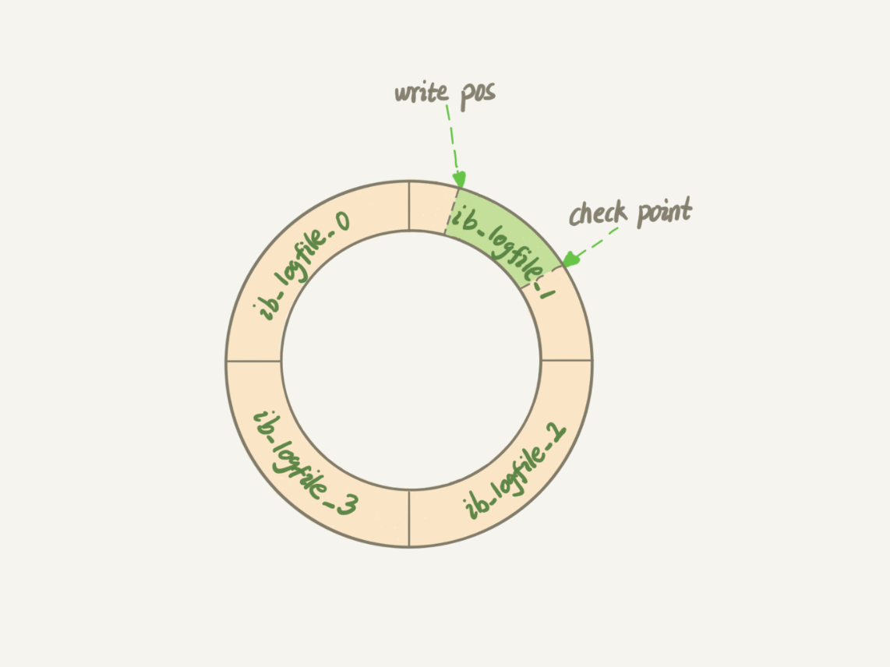
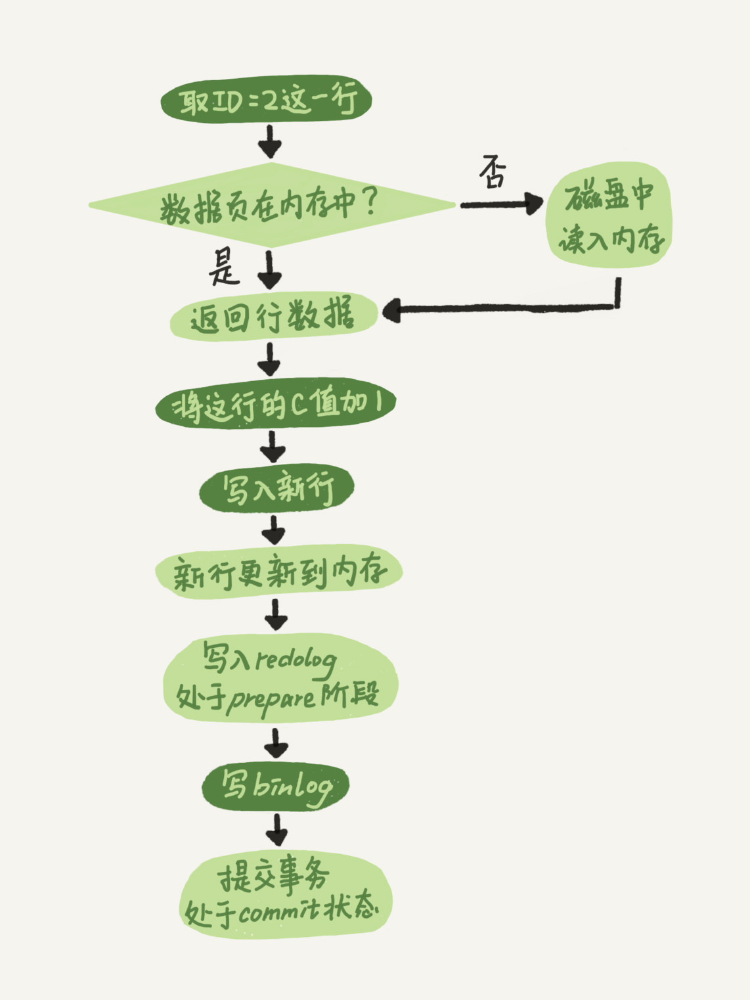
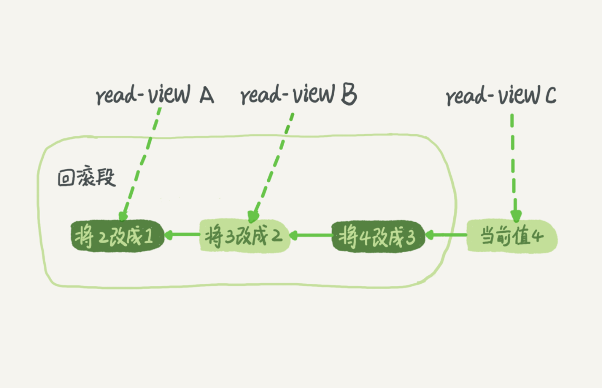

## 

查看mysql连接信息

```
mysql> show processlist;
+----+-----------------+-----------+------+---------+------+------------------------+------------------+
| Id | User            | Host      | db   | Command | Time | State                  | Info             |
+----+-----------------+-----------+------+---------+------+------------------------+------------------+
|  5 | event_scheduler | localhost | NULL | Daemon  | 3262 | Waiting on empty queue | NULL             |
|  8 | root            | localhost | NULL | Sleep   | 3113 |                        | NULL             |
|  9 | root            | localhost | NULL | Query   |    0 | init                   | show processlist |
+----+-----------------+-----------+------+---------+------+------------------------+------------------+
3 rows in set, 1 warning (0.00 sec)

```

### Mysql系统架构

- 客户端
- Server 层
    - 连接器
    - 分析器
    - 优化器
- 存储引擎层


### select 查询过程

1. 建立连接
2. 查询缓存（不建议使用） 按需设置，将参数 query_cache_type 设置成 DEMAND，这样对于默认的 SQL 语句都不使用查询缓存。而对于你确定要使用查询缓存的语句，可以用 SQL_CACHE 显式指定。如：mysql> select SQL_CACHE * from T where ID=10；
3. 分析器进行词法分析和语法分析，词法分析是解析sql语句的功能，语法分析是检查sql语句语法是否正确；
4. 优化器决定使用哪个索引或者在多表关联时决定各个表的连接顺序，即确定mysql语句的执行方案；
5. 执行器检查用户执行权限，权限满足，则调用存储引擎提供的接口对表进行查询或其他操作

### sql更新过程

sql更新语句：
mysql> update T set c=c+1 where ID=2;

在一个表上有更新的时候，跟这个表有关的查询缓存会失效。

更新流程涉及两个重要的日志模块：redo log（重做日志）和 binlog（归档日志）


- redo log

mysql主要使用WAL技术实现redo log。

WAL 技术，WAL 的全称是 Write-Ahead Logging，它的关键点就是先写日志，再写磁盘。InnoDB 的 redo log 是固定大小的，比如可以配置为一组 4 个文件，每个文件的大小是 1GB，那么redo log总共就可以记录 4GB 的操作。


- 性能好的原因

Redo log是顺序写，并且可以组提交，还有别的一些优化，收益最大是是这两个因素；



write pos 是当前记录的位置，一边写一边后移，写到第 3 号文件末尾后就回到 0 号文件开头。
checkpoint 是当前要擦除的位置，也是往后推移并且循环的，擦除记录前要把记录更新到数据文件。

这句话，说的“空着的部分”，就是write pos 到3号文件末尾，再加上0号文件开头到checkpoint 的部分。

- binlog

两种日志的不同点：
1. redo log 是 InnoDB 引擎特有的日志，binlog 是 MySQL 的 Server 层实现的，所有引擎都可以使用。
2. redo log 是循环写的，空间固定会用完；binlog 是可以追加写入的。“追加写”是指 binlog 文件写到一定大小后会切换到下一个，并不会覆盖以前的日志。
3. redo log 是物理日志，记录的是“在某个数据页上做了什么修改”；binlog 是逻辑日志，记录的是这个语句的原始逻辑，比如“给 ID=2 这一行的 c 字段加 1 ”。

innoDB执行update流程：

图中浅色框表示是在 InnoDB 内部执行的，深色框表示是在执行器中执行的。




将 redo log 的写入拆成了两个步骤：prepare 和 commit，这就是"两阶段提交"。

- 两阶段提交

为了保证数据库的状态和用它的日志恢复出来的库的状态一致。即确保redo log和binlog的内容一致。


- 两种日志记录内容

Redo log不是记录数据页“更新之后的状态”，而是记录这个页 “做了什么改动”。
Binlog有两种模式，statement 格式的话是记sql语句， row格式会记录行的内容，记两条，更新前和更新后都有。


- 经典问题

然后说下由redo log联想到之前遇到的一个问题：一个普通的select查询超过30ms，经过和DBA的联合排查，确认是由于MySQL“刷脏”导致的。

所谓刷脏就是由于内存页和磁盘数据不一致导致了该内存页是“脏页”，将内存页数据刷到磁盘的操作称为“刷脏”。刷脏是为了避免产生“脏页”，主要是因为MySQL更新先写redo log再定期批量刷到磁盘的，这就导致内存页的数据和磁盘数据不一致，为了搞清楚为什么“刷脏”会导致慢查，我们先分析下redo log再哪些场景会刷到磁盘。

场景1：redo log写满了，此时MySQL会停止所有更新操作，把脏页刷到磁盘
场景2：系统内存不足，需要将脏页淘汰，此时会把脏页刷到磁盘
场景3：系统空闲时，MySQL定期将脏页刷到磁盘

可以想到，在场景1和2都会导致慢查的产生，根据文章提到的，redo log是可以循环写的，那么即使写满了应该也不会停止所有更新操作吧，其实是会的，文中有句话“粉板写满了，掌柜只能停下手中的活，把粉板的一部分赊账记录更新到账本中，把这些记录从粉板删除，为粉板腾出新的空间”，这就意味着写满后是会阻塞一段时间的。

那么问题来了，innodb存储引擎的刷脏策略是怎么样的呢？通常而言会有两种策略：全量（sharp checkpoint）和部分（fuzzy checkpoint）。全量刷脏发生在关闭数据库时，部分刷脏发生在运行时。部分刷脏又分为定期刷脏、最近最少使用刷脏、异步/同步刷脏、脏页过多刷脏。

- 日志参数设置

redo log 用于保证 crash-safe 能力。innodb_flush_log_at_trx_commit 这个参数设置成 1 的时候，表示每次事务的 redo log 都直接持久化到磁盘。这个参数我建议你设置成 1，这样可以保证 MySQL 异常重启之后数据不丢失。

sync_binlog 这个参数设置成 1 的时候，表示每次事务的 binlog 都持久化到磁盘。这个参数我也建议你设置成 1，这样可以保证 MySQL 异常重启之后 binlog 不丢失。

### 事务的隔离

事务就是要保证一组数据库操作，要么全部成功，要么全部失败。事务是在引擎层实现的，

- 隔离性与隔离级别

当数据库上有多个事务同时执行的时候，就可能出现脏读（dirty read）、不可重复读（non-repeatable read）、幻读（phantom read）的问题，为了解决这些问题，就有了“隔离级别”的概念。

隔离级别：

- 读未提交是指，一个事务还没提交时，它做的变更就能被别的事务看到。
- 读提交是指，一个事务提交之后，它做的变更才会被其他事务看到。
- 可重复读是指，一个事务执行过程中看到的数据，总是跟这个事务在启动时看到的数据是一致的。当然在可重复读隔离级别下，未提交变更对其他事务也是不可见的。
- 串行化，顾名思义是对于同一行记录，“写”会加“写锁”，“读”会加“读锁”。当出现读写锁冲突的时候，后访问的事务必须等前一个事务执行完成，才能继续执行。

- 查看事务的隔离级别

mysql> show variables like 'transaction_isolation';

+-----------------------+----------------+

| Variable_name | Value |

+-----------------------+----------------+

| transaction_isolation | READ-COMMITTED |

+-----------------------+----------------+


- 事务隔离的实现

在 MySQL 中，实际上每条记录在更新的时候都会同时记录一条回滚操作。记录上的最新值，通过回滚操作，都可以得到前一个状态的值。假设一个值从 1 被按顺序改成了 2、3、4，在回滚日志里面就会有类似下面的记录。



- 事务启动方式

1. 显式启动事务语句， begin 或 start transaction。配套的提交语句是 commit，回滚语句是 rollback。

2. set autocommit=0，这个命令会将这个线程的自动提交关掉。意味着如果你只执行一个 select 语句，这个事务就启动了，而且并不会自动提交。这个事务持续存在直到你主动执行 commit 或 rollback 语句，或者断开连接。

建议你总是使用 set autocommit=1, 通过显式语句的方式来启动事务。

在 autocommit 为 1 的情况下，用 begin 显式启动的事务，如果执行 commit 则提交事务。如果执行 **commit work and chain**，则是提交事务并自动启动下一个事务，这样也省去了再次执行 begin 语句的开销。同时带来的好处是从程序开发的角度明确地知道每个语句是否处于事务中。

- 长事务查询

### 索引

索引的出现其实就是为了提高数据查询的效率，就像书的目录一样。

主键索引的b+树的叶子节点存储的是具体的行数据，非叶子节点存储的是主键的值。叶子节点之间通过链表连接 非主键索引的叶子节点存储的是主键的值，所以通过非主键索引查询数据时，先找到主键，再去主键索引上根据主键找到具体的行数据

 B+树的叶子节点是page （页），一个页里面可以存多个行，page内部怎么去定位行数据，内部有个有序数组，二分法定位行。


 - 最左前缀原则

 这个最左前缀可以是联合索引的最左 N 个字段，也可以是字符串索引的最左 M 个字符。

 在建立联合索引的时候，如何安排索引内的字段顺序？
 
 1. 第一原则是，如果通过调整顺序，可以少维护一个索引，那么这个顺序往往就是需要优先考虑采用的。
 2. 第二考虑的原则就是空间了


 - 索引下推（index condition pushdown）

 对于联合索引，在索引遍历过程中，对索引中包含的字段先做判断，直接过滤掉不满足条件的记录，减少回表次数。


1. 覆盖索引：如果查询条件使用的是普通索引（或是联合索引的最左原则字段），查询结果是联合索引的字段或是主键，不用回表操作，直接返回结果，减少IO磁盘读写读取正行数据
2. 最左前缀：联合索引的最左 N 个字段，也可以是字符串索引的最左 M 个字符
3. 联合索引：根据创建联合索引的顺序，以最左原则进行where检索，比如（age，name）以age=1 或 age= 1 and name=‘张三’可以使用索引，单以name=‘张三’ 不会使用索引，考虑到存储空间的问题，还请根据业务需求，将查找频繁的数据进行靠左创建索引。
4. 索引下推：like 'hello%’and age >10 检索，MySQL5.6版本之前，会对匹配的数据进行回表查询。5.6版本后，会先过滤掉age<10的数据，再进行回表查询，减少回表率，提升检索速度


### 锁


锁的分类：全局锁、表级锁、行锁

全局锁和表锁是Server层实现的。

#### 全局锁

全局锁的典型使用场景是，做全库逻辑备份。也就是把整库每个表都 select 出来存成文本。

全局锁就是对整个数据库实例加锁。MySQL 提供了一个加全局读锁的方法，命令是 Flush tables with read lock (FTWRL)。当你需要让整个库处于只读状态的时候，可以使用这个命令，之后其他线程的以下语句会被阻塞：数据更新语句（数据的增删改）、数据定义语句（包括建表、修改表结构等）和更新类事务的提交语句。


官方自带的逻辑备份工具是 mysqldump。当 mysqldump 使用参数–single-transaction 的时候，导数据之前就会启动一个事务，来确保拿到一致性视图。而由于 MVCC 的支持，这个过程中数据是可以正常更新的。

single-transaction 方法只适用于所有的表使用事务引擎的库。如果有的表使用了不支持事务的引擎，那么备份就只能通过 FTWRL 方法。


#### 表级锁

1. 表锁

表锁的语法是 lock tables … read/write。与 FTWRL 类似，可以用 unlock tables 主动释放锁，也可以在客户端断开的时候自动释放。需要注意，lock tables 语法除了会限制别的线程的读写外，也限定了本线程接下来的操作对象。


2. 元数据锁（meta data lock，MDL）

另一类表级的锁是 MDL（metadata lock)。MDL 不需要显式使用，在访问一个表的时候会被自动加上。MDL 会直到事务提交才释放，在做表结构变更的时候，你一定要小心不要导致锁住线上查询和更新。


因此，在 MySQL 5.5 版本中引入了 MDL，当对一个表做增删改查(DML)操作的时候，加 MDL 读锁；当要对表做结构变更(DDL)操作的时候，加 MDL 写锁。

- 读锁之间不互斥，因此你可以有多个线程同时对一张表增删改查。
- 读写锁之间、写锁之间是互斥的，用来保证变更表结构操作的安全性。因此，如果有两个线程要同时给一个表加字段，其中一个要等另一个执行完才能开始执行。

如何安全的给小表家字段？？

比较理想的机制是，在 alter table 语句里面设定等待时间，如果在这个指定的等待时间里面能够拿到 MDL 写锁最好，拿不到也不要阻塞后面的业务语句，先放弃。之后开发人员或者 DBA 再通过重试命令重复这个过程。

```
ALTER TABLE tbl_name NOWAIT add column ...
ALTER TABLE tbl_name WAIT N add column ... 
```


Online DDL的过程是这样的：
1. 拿MDL写锁
2. 降级成MDL读锁
3. 真正做DDL
4. 升级成MDL写锁
5. 释放MDL锁

1、2、4、5如果没有锁冲突，执行时间非常短。第3步占用了DDL绝大部分时间，这期间这个表可以正常读写数据，是因此称为“online ”

我们文中的例子，是在第一步就堵住了。


#### 行锁

MySQL 的行锁是在引擎层由各个引擎自己实现的。但并不是所有的引擎都支持行锁，比如 MyISAM 引擎就不支持行锁。不支持行锁意味着并发控制只能使用表锁，对于这种引擎的表，同一张表上任何时刻只能有一个更新在执行，这就会影响到业务并发度。


- 两阶段锁


实际上事务 B 的 update 语句会被阻塞，直到事务 A 执行 commit 之后，事务 B 才能继续执行。事务 A 持有的两个记录的行锁，都是在 commit 的时候才释放的。

在 InnoDB 事务中，行锁是在需要的时候才加上的，但并不是不需要了就立刻释放，而是要等到事务结束时才释放。这个就是两阶段锁协议。

事务中，行锁是在语句执行时才加上的，不是事务开始就加上，但释放是统一在事务结束时才释放。根据这个特性，对于高并发的行记录的操作语句就可以尽可能的安排到最后面，以减少锁等待的时间，提高并发性能。

**果你的事务中需要锁多个行，要把最可能造成锁冲突、最可能影响并发度的锁尽量往后放**。

- 死锁和死锁检测

当出现死锁以后，有两种策略：

1. 一种策略是，直接进入等待，直到超时。这个超时时间可以通过参数 innodb_lock_wait_timeout 来设置。
2. 另一种策略是，发起死锁检测，发现死锁后，主动回滚死锁链条中的某一个事务，让其他事务得以继续执行。将参数 innodb_deadlock_detect 设置为 on，表示开启这个逻辑。

什么时候会进行死锁检测？？
> 如果他要加锁访问的行上有锁，他才要检测。

这里面我担心你有两个误解，说明下：
1.   一致性读不会加锁，就不需要做死锁检测；

2. 并不是每次死锁检测都都要扫所有事务。比如某个时刻，事务等待状态是这样的：

   B在等A，
   D在等C，
   现在来了一个E，发现E需要等D，那么E就判断跟D、C是否会形成死锁，这个检测不用管B和A

在 InnoDB 中，innodb_lock_wait_timeout 的默认值是 50s，

死锁检测的时间复杂度是O(n^2),n为并发的线程数量。


- 怎么解决由这种热点行更新导致的性能问题呢？问题的症结在于，死锁检测要耗费大量的 CPU 资源。


另一个思路是控制并发度，但是，你会很快发现这个方法不太可行，因为客户端很多。我见过一个应用，有 600 个客户端，这样即使每个客户端控制到只有 5 个并发线程，汇总到数据库服务端以后，峰值并发数也可能要达到 3000。

因此，这个并发控制要做在数据库服务端。如果你有中间件，可以考虑在中间件实现；如果你的团队有能修改 MySQL 源码的人，也可以做在 MySQL 里面。基本思路就是，对于相同行的更新，在进入引擎之前排队。这样在 InnoDB 内部就不会有大量的死锁检测工作了。

你可以考虑通过将一行改成逻辑上的多行来减少锁冲突

